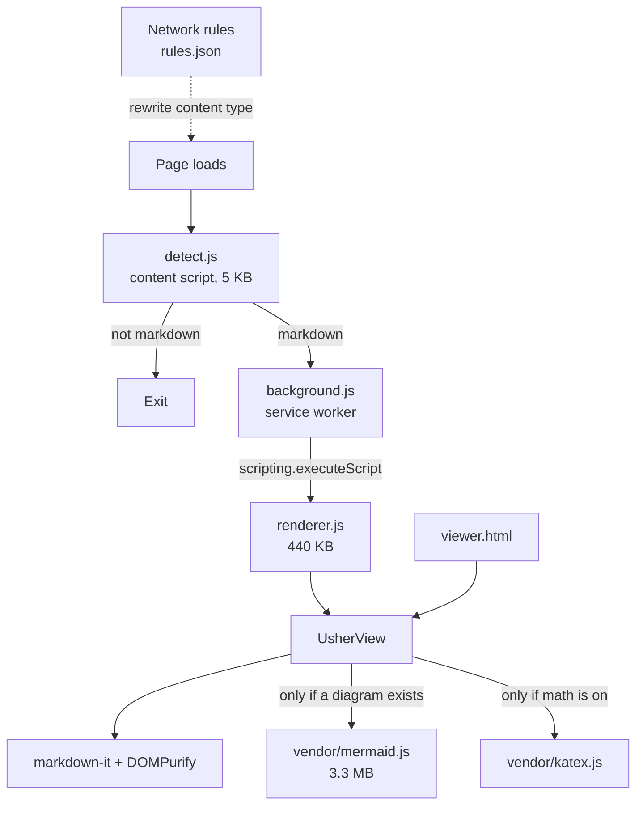

# Design

## Why it exists

Chromium will not render a markdown file. A `.md` file on disk shows as plain
text; a `.md` file on the web usually downloads. Usher closes that gap without
sending anything anywhere: the document is parsed and rendered in the tab it is
already in.

## Constraints that shaped it

1. **A content script runs on every page you visit.** It has to be small and it
   has to exit fast on the 99.9% of pages that are not markdown.
2. **Manifest V3 forbids remote code.** Mermaid and KaTeX are bundled and loaded
   from the extension's own files.
3. **Mermaid is 3.3 MB.** Parsing that on every page load is not acceptable, so
   it is a separate bundle injected only when a document contains a diagram.
4. **Markdown can contain arbitrary HTML.** Anything rendered has to be
   sanitised before it touches the DOM.

## Architecture

Three entry points share one renderer:

| Entry | Runs in | Loads Mermaid by |
|-------|---------|------------------|
| `detect.js` → `renderer.js` | The page's isolated world | Asking the service worker to `executeScript` the vendor file into the same world |
| `viewer.html` → `viewer.js` | An extension page | Appending a `<script>` tag |
| Popup / context menu | Triggers the same injection | Same as above |

`VendorLoader` is the seam between those two strategies, and `ensureVendor`
makes sure a bundle is only fetched once per realm no matter how many diagrams
ask for it.

## The detection pipeline

`shouldAutoRender` in `src/shared/md-detect.ts` is a pure function, so the whole
policy is unit tested without a browser. It answers in this order:

1. Extension disabled → stop.
2. Origin on the never-render list → stop.
3. Scheme is not `http`, `https`, `file`, or `ftp` → stop.
4. The document is not Chromium's plain-text viewer (a body whose only element
   child is `<pre>`) → stop.
5. The URL has a markdown extension → render.
6. The server declared a markdown content type → render.
7. Origin on the always-render list → render.
8. Mode is `never` → stop. Mode is `extension` → stop.
9. Mode is `smart` → score the text and decide.

The scoring in `looksLikeMarkdown` is weighted rather than a plain count.
Headings, fences, front matter, table delimiters, and images score 2; bullets,
links, and bold score 1; the threshold is 2. A document with one heading counts,
a log file with one stray bullet does not.

### Recovering the content type

The network rules rewrite `text/markdown` to `text/plain` on the top-level
document so the browser displays it. That erases the very signal that says
"this is markdown", which matters for URLs with no file extension.

The rules apply to `main_frame` only, so a second request for the same URL still
reports the original header. `needsContentTypeProbe` decides when that is worth
doing: the document is plain text, the scheme is HTTP, the extension does not
already answer the question, the extension is not a known non-markdown one like
`.log` or `.json`, and no site rule applies. In practice this fires on almost
nothing.

## Network rules

`public/rules.json` holds three static declarativeNetRequest rules:

| Rule | Condition | Action |
|------|-----------|--------|
| 1 | Response content type is a markdown media type | Set `text/plain` |
| 2 | Markdown URL served as an octet stream | Set `text/plain`, drop `Content-Disposition` |
| 3 | Markdown URL with `Content-Disposition: attachment` | Drop the header |

Response-header conditions need Chromium 128, which is why the manifest sets
`minimum_chrome_version`.

## Security model

Two DOMPurify profiles:

- **Markdown HTML** — the HTML profile plus SVG and MathML. `script`, `style`,
  `iframe`, `object`, `embed`, `form`, `base`, `link`, and `meta` are removed,
  along with `srcdoc`, `formaction`, and `ping`. URLs are restricted to a known
  scheme list. External links get `rel="noopener noreferrer"`.
- **Mermaid SVG** — the SVG profile. Mermaid output is generated from the
  document's own text, but it is still sanitised.

Mermaid is configured with `htmlLabels: false` so labels are native `<text>`
elements. The alternative is `<foreignObject>`, which DOMPurify strips as an
mXSS vector; allowing it back would have meant weakening the sanitiser to make a
cosmetic feature work.

## Diagram sizing

Mermaid's `useMaxWidth` shrinks a diagram to its container, which for a
2600px-wide flowchart in a 800px column means unreadable 5px text. It is turned
off, and sizing is handled here instead:

- The natural size comes from the SVG's `viewBox`, not its layout box. The
  element is inside a container by the time this runs, so measuring the layout
  box returns the already-shrunk size.
- The SVG sits absolutely positioned inside a canvas `div` whose width and
  height are set to `natural x scale`. That gives the stage a real scrollable
  area and keeps the diagram centred, which a bare CSS transform does not.
- The fit scale is `clamp(stageWidth / naturalWidth, 0.55, 1)`. Below the floor
  the diagram scrolls rather than shrinking further.
- Dragging sets `scrollLeft` and `scrollTop` rather than translating, so it
  cooperates with the scrollbars instead of fighting them.

## Sanitiser workarounds
Two things the sanitiser does that the renderer has to undo deliberately:

- It drops `type` from task-list checkboxes, so `decorateTaskLists` restores
  `type="checkbox"` and marks them disabled. Doing it in the DOM rather than
  fighting the sanitiser config keeps the result independent of DOMPurify's
  element policy.
- It drops `<style>` from markdown, which is intended. Custom CSS goes through
  the settings instead.

## Build

`scripts/build.mjs` runs esbuild over eight entry points into IIFE bundles. Two
choices are worth remembering:

- **`charset: 'ascii'`.** `chrome.scripting.executeScript` reads injected files
  with a strict UTF-8 check that rejects non-characters. Mermaid contains a
  single `U+FFFF` sentinel, which is valid UTF-8 but fails that check, so the
  file loaded fine as a `<script>` tag in the viewer and failed to inject into a
  page. Escaping every non-ASCII code point makes the output pure ASCII and
  sidesteps it.
- **IIFE, not ESM.** Injected files share the isolated world's global scope,
  which is how `renderer.js` picks up `globalThis.__usherMermaid` after the
  service worker injects the vendor bundle.

`scripts/gen-icons.mjs` draws the icons as a signed distance field and encodes
PNGs by hand, and `scripts/pack.mjs` writes the store zip, so the build has no
image or archive dependency.

## Code map

| Path | Holds |
|------|-------|
| `src/shared/md-detect.ts` | The detection policy. Pure, fully tested. |
| `src/shared/settings.ts` | Defaults, storage, change notification |
| `src/shared/slug.ts` | GitHub-compatible heading slugs |
| `src/shared/frontmatter.ts` | YAML and TOML front matter splitting |
| `src/core/markdown.ts` | markdown-it setup, alerts, `:::` containers, mermaid and math fences |
| `src/core/sanitize.ts` | The two DOMPurify profiles |
| `src/core/highlight.ts` | Curated highlight.js languages and aliases |
| `src/core/render-shell.ts` | `UsherView`: shell, TOC, scroll spy, toolbars |
| `src/core/mermaid-host.ts` | Diagram rendering, zoom and pan, export |
| `src/core/math-host.ts` | KaTeX rendering |
| `src/core/vendor-loader.ts` | Lazy bundle loading, both strategies |
| `src/detect.ts` | The per-page content script |
| `src/renderer.ts` | Injected renderer, live reload, page commands |
| `src/background.ts` | Injection, context menus, commands, badge |
| `src/pages/` | Popup, options, viewer |
| `public/` | Manifest, HTML, CSS, network rules, icons |

## Things deliberately left out

- **No `webRequest`.** Observing headers would make the content-type case
  simpler, but it is a heavy permission and the `HEAD` probe covers it.
- **No remote fetching of themes or fonts.** Everything ships in the package.
- **No persistence of checkbox clicks.** Task lists are read-only; a checkbox
  that appears to save but does not is worse than one that is clearly disabled.
- **No MDX.** It looks like markdown but is not, and half-rendering it is worse
  than leaving it as text.
