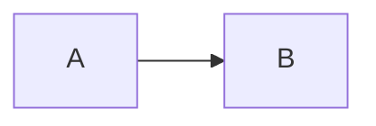

# Usage

## Install

```powershell
npm install
npm run build
```

Load `dist/` as an unpacked extension:

| Browser | Page | Steps |
|---------|------|-------|
| Chrome | `chrome://extensions` | Developer mode → Load unpacked → `dist` |
| Edge | `edge://extensions` | Developer mode → Load unpacked → `dist` |

Usher needs Chrome or Edge **128 or newer**. The network rules that stop `.md`
files downloading use response-header conditions, which older builds do not
support.

## Local files

Chromium hides `file://` pages from extensions until you opt in per extension.

1. Open the extension's details page (the popup has a shortcut when the
   permission is missing).
2. Turn on **Allow access to file URLs**.
3. Open any `.md` file. `file:///C:/repo/README.md` renders in place.

While a local file is open, Usher polls it and re-renders when the bytes
change, keeping your scroll position. Turn this off with **Live reload local
files** in settings, or change the poll interval.

## Web pages

Usher handles the three ways markdown arrives over HTTP:

| The server sends | What happens |
|------------------|--------------|
| `text/plain` with a `.md` URL | Rendered directly. |
| `text/markdown` | The response header is rewritten to `text/plain` so the browser shows it instead of downloading it, then it is rendered. |
| `application/octet-stream` or `Content-Disposition: attachment` with a `.md` URL | The download is cancelled and the file is shown as a page. |

If the URL has no extension but the server declared a markdown content type,
Usher re-checks the URL with a `HEAD` request and renders it. That probe only
runs for extensionless plain-text pages, so it costs nothing on normal browsing.

## Rendering something that is not a markdown file

- **Popup → Render this page** turns the current page's text into markdown.
- **Right-click → Render selection as Markdown** opens the selection in the viewer.
- **Viewer** (`Alt` + `Shift` + `V`) accepts a file picker, a drag and drop, a
  paste, or typing straight into the editor pane with a live preview.
- **`viewer.html?url=…`** renders a remote document without navigating to it.

## Auto-render modes

| Mode | Behaviour |
|------|-----------|
| **Markdown file extensions** (default) | Renders `.md`, `.markdown`, `.mdown`, `.mkd`, `.mkdn`, `.mdwn`, `.mdtxt`, `.mdtext`, `.mmd`, `.rmd`, `.qmd`, plus anything the server labelled as markdown. |
| **Smart detection** | Also inspects other plain-text pages and renders them when the content scores as markdown (a heading or a fenced block is enough; a stray bullet is not). |
| **Manual only** | Never renders on its own. Use the popup or the keyboard shortcut. |

Per-site overrides live in settings, and the popup has an **Always render on
this site** switch for the current origin. All local files share one key,
`file://`.

## Settings

| Group | Settings |
|-------|----------|
| Rendering | Enable, auto-render mode, front matter table, linkify, smart quotes, emoji shortcodes |
| Appearance | Theme, content width, base font size, table of contents, collapsed by default, heading anchors |
| Code and diagrams | Syntax highlighting, line numbers, copy buttons, Mermaid on/off, Mermaid theme, KaTeX math |
| Local files | Live reload, poll interval, scroll restore |
| Sites | Always-render and never-render lists |
| Custom CSS | Applied to every rendered document; target `.usher-markdown` |
| Backup | Export, import, reset |

Math is off by default because `$` is common in ordinary prose. Turn it on and
`$…$` and `$$…$$` render with KaTeX.

## Diagrams

Usher accepts both fence styles:

````markdown

````

```markdown
:::mermaid
flowchart LR
    A --> B
:::
```

The `:::` form is what Azure DevOps wikis, GitLab, and Docusaurus emit. An
unterminated container is closed at the end of the document rather than
swallowing the rest of the file.

A wide diagram is drawn at its natural size and scaled to fit the column, but
never below 55%, because anything smaller is unreadable. Past that it scrolls,
and the stage can be dragged. The toolbar in the corner has zoom, fit,
full screen, copy source, and SVG or PNG export.

| Gesture | Action |
|---------|--------|
| Drag, or scroll | Pan |
| `Ctrl` + scroll | Zoom |
| Double-click | Fit to width |
| `Esc` | Leave full screen |

Diagram labels are drawn as SVG text rather than embedded HTML, so HTML markup
inside a label is not supported. That is deliberate: the HTML form needs
`<foreignObject>`, which the sanitiser strips.

## Container blocks

`:::` blocks also cover admonitions. `note`, `info`, `tip`, `important`,
`warning`, `caution`, `danger`, and `error` render as coloured callouts, and any
other name becomes a plain `div` with a matching class you can target from
custom CSS. Text after the name becomes the callout title.

```markdown
:::tip Worth knowing
The body is parsed as **Markdown**.
:::
```

## Keyboard

| Key | Action |
|-----|--------|
| `t` | Toggle the table of contents |
| `r` | Toggle rendered / raw source |
| `Shift` + `P` | Print |
| `Alt` + `Shift` + `M` | Toggle rendering on the current page |
| `Alt` + `Shift` + `V` | Open the viewer |

Diagrams: `Ctrl` + scroll to zoom, drag or scroll to pan, double-click to fit.
The toolbar in the corner expands to full screen, copies the diagram source, and
exports SVG or PNG.

## Printing

`Print` (or `Ctrl` + `P`) drops the sidebar, header actions, progress bar, and
copy buttons, and keeps code blocks, tables, and diagrams from splitting across
pages. Print to PDF for a clean copy of the document.

## Troubleshooting

| Symptom | Cause and fix |
|---------|---------------|
| Local file shows raw text | **Allow access to file URLs** is off for the extension. |
| `.md` link downloads instead of rendering | The browser is older than 128, or the server sent a content type not covered by the rules. Open the file from the viewer as a workaround. |
| Nothing renders on a specific site | The origin is in the never-render list, or the page is HTML rather than plain text. Use **Render this page** in the popup. |
| A `:::mermaid` block shows as a paragraph | The closing `:::` is missing *and* the block is followed by something that looks like another container. Close the block. |
| Diagram shows its source with an error line | Mermaid rejected the syntax. The message from Mermaid is on the first line. |
| Diagram is small and scrolls sideways | It is wider than the column even at the readability floor. Use the full-screen button, or set **Content width** to wide or full. |
| Diagram labels look wrong | Labels are drawn as SVG text, not HTML, so HTML markup inside a label is not supported. |
| Nothing works on `chrome://` or the Web Store | Chromium blocks all extensions on those pages. Nothing can be done about it. |

## Development

```powershell
npm run watch      # rebuild on change
npm run verify     # typecheck + tests + production build
```

After a rebuild, press the reload button on the extension card, then reload the
page you are testing. Editing only `public/` files still needs the rebuild,
since `dist/` is what the browser loads.
