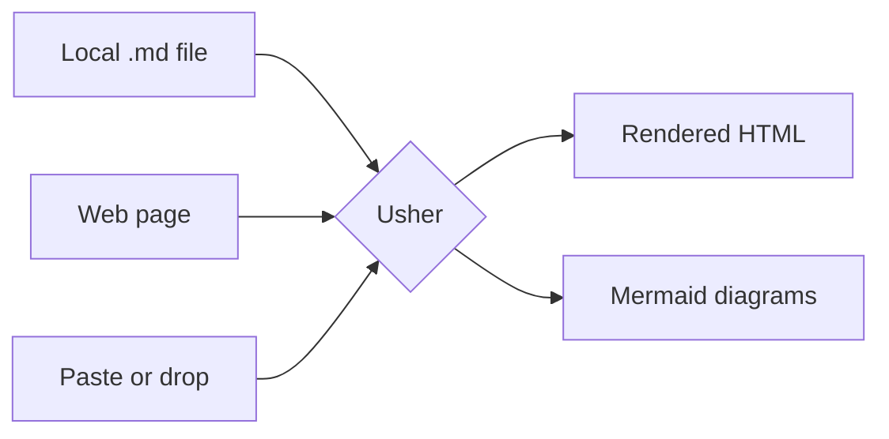
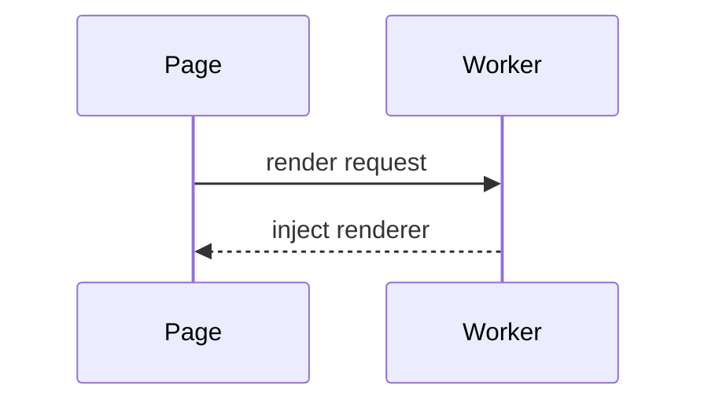
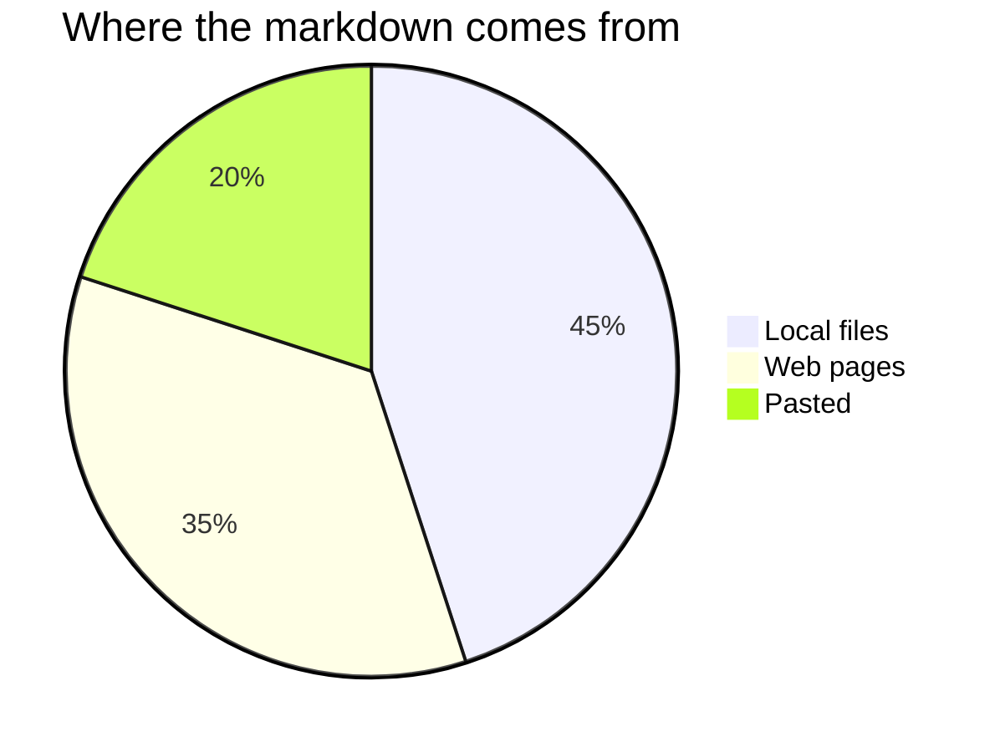

# Usher smoke test

This file exercises everything the extension is supposed to render. Open it from
`file://` after enabling **Allow access to file URLs**.

> [!NOTE]
> Alerts should render as coloured callouts with an icon and a bold title.

> [!WARNING]
> This one should be amber.

## Mermaid







## Code

```powershell
$files = Get-ChildItem -Path . -Filter *.md -Recurse
foreach ($file in $files) {
    Write-Host "Found $($file.FullName)"
}
```

```csharp
public sealed class Renderer
{
    public string Render(string markdown) => Pipeline.Run(markdown);
}
```

```sql
SELECT TOP 10 CapacityId, State
FROM dbo.Capacities
WHERE State = 'Active';
```

Inline `code` and a [link](https://example.com) and **bold** and *italic* and ~~struck~~.

## Table

| Feature | Status | Notes |
| --- | --- | --- |
| GFM tables | Done | Scrollable wrapper |
| Task lists | Done | Checkboxes render |
| Footnotes | Done | Linked both ways |

## Lists

- [x] Render local files
- [x] Render web pages
- [ ] Something not done yet

1. First
2. Second
   - Nested
   - Items

Term
:   A definition list entry.

## Footnotes

Here is a claim that needs a source[^1].

[^1]: The supporting note.

## Escaping

<script>window.__pwned = true;</script>


<div class="kept">Plain HTML should survive sanitising.</div>
